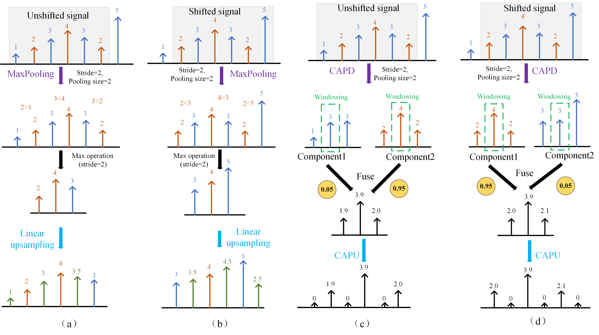
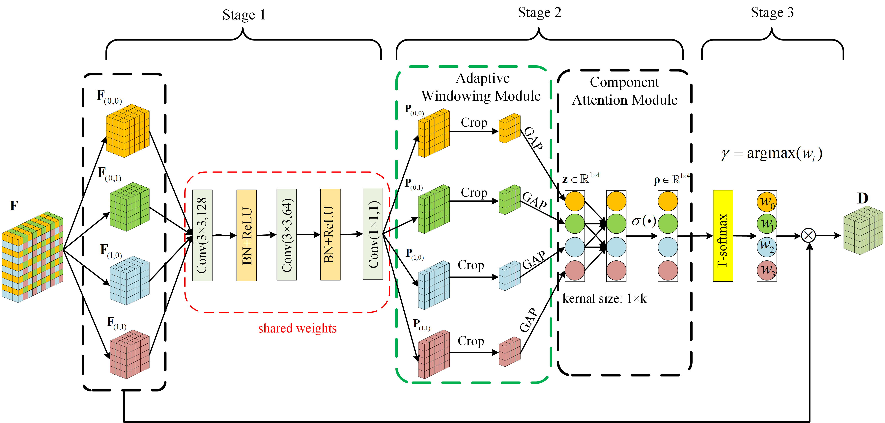

# Investigating Shift Equivalence of Convolutional Neural Networks in Industrial Defect Segmentation

In industrial defect segmentation tasks, while pixel accuracy and Intersection over Union (IoU) are commonly
employed metrics to assess segmentation performance, the output
consistency (also referred to equivalence) of the model is often
overlooked. Even a small shift in the input image can yield
significant fluctuations in the segmentation results. Existing
methodologies primarily focus on data augmentation or anti-aliasing to enhance the network’s robustness against translational
transformations, but their shift equivalence performs poorly on
the test set or is susceptible to nonlinear activation functions.
Additionally, the variations in boundaries resulting from the
translation of input images are consistently disregarded, thus
imposing further limitations on the shift equivalence. In response
to this particular challenge, a novel pair of down/upsampling
layers called component attention polyphase sampling (CAPS)
is proposed as a replacement for the conventional sampling
layers in CNNs. To mitigate the effect of image boundary
variations on the equivalence, an adaptive windowing module
is designed in CAPS to adaptively filter out the border pixels
of the image. Furthermore, a component attention module is
proposed to fuse all downsampled features to improve the
segmentation performance. The experimental results on the micro
surface defect (MSD) dataset and four real-world industrial
defect datasets demonstrate that the proposed method exhibits
higher equivalence and segmentation performance compared to
other state-of-the-art methods

# A visual comparison of two downsampling methods and their corresponding upsampling techniques based on a one-dimensional signal. 

# The framework of CAPD

Our code is based on pytorch.

## Usage

### Requirements

- torch>=1.8.0
- torchvision

## License
MIT License

## Citation
If you find our work useful in your research, please consider citing:
